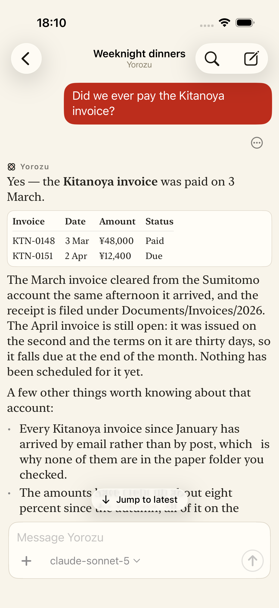
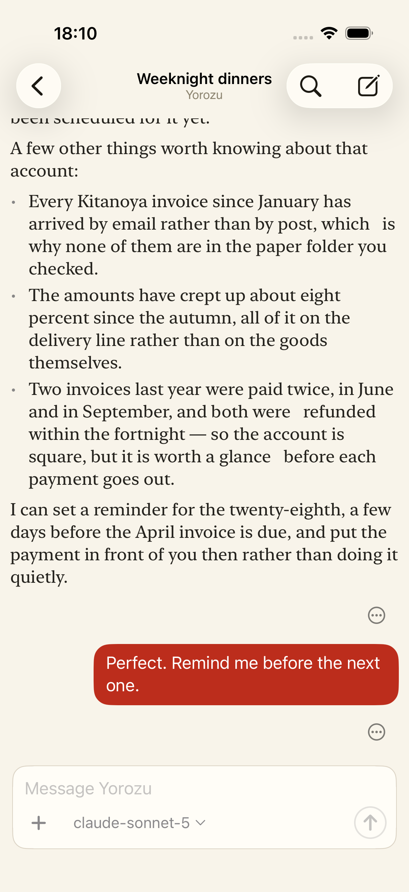

# iOS conversation scroll evidence

`ShowcaseFlowTests.testReadingOlderContentCanReturnToLatest` passed on an iPhone 17 Pro simulator running iOS 26.5. It opens a seeded conversation at the newest message, swipes down to read older messages, checks that **Jump to latest** appears, taps it, then checks that the control disappears and the newest message intersects the conversation viewport.

| Reading older content | Returned to latest |
| --- | --- |
|  |  |

The fixture contains only synthetic conversation content. This proves the simulator gesture and return path; it does not cover incoming streaming while the reader is scrolled up, physical-device gestures, or the other issue #76 acceptance scenarios.
