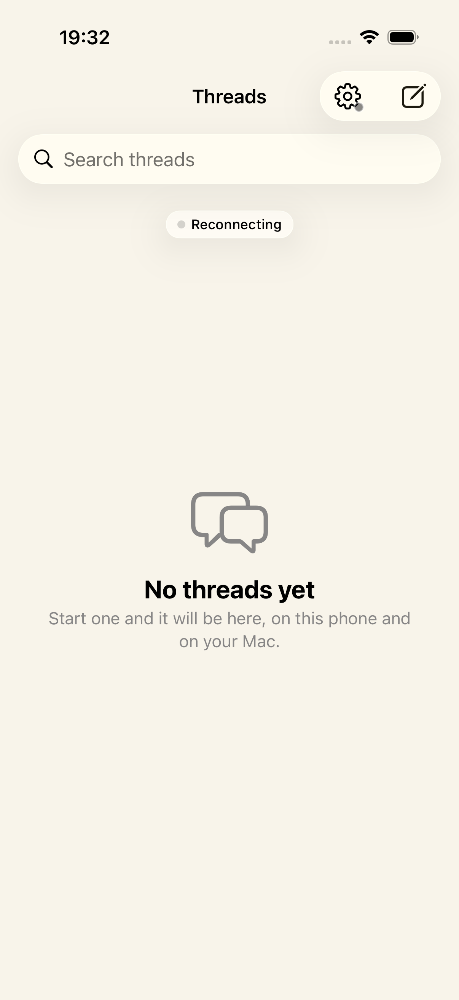
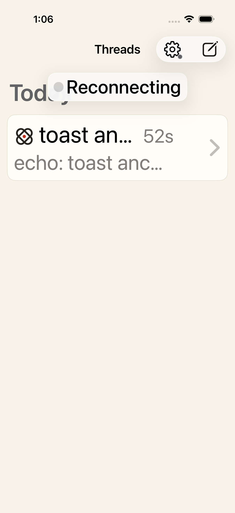
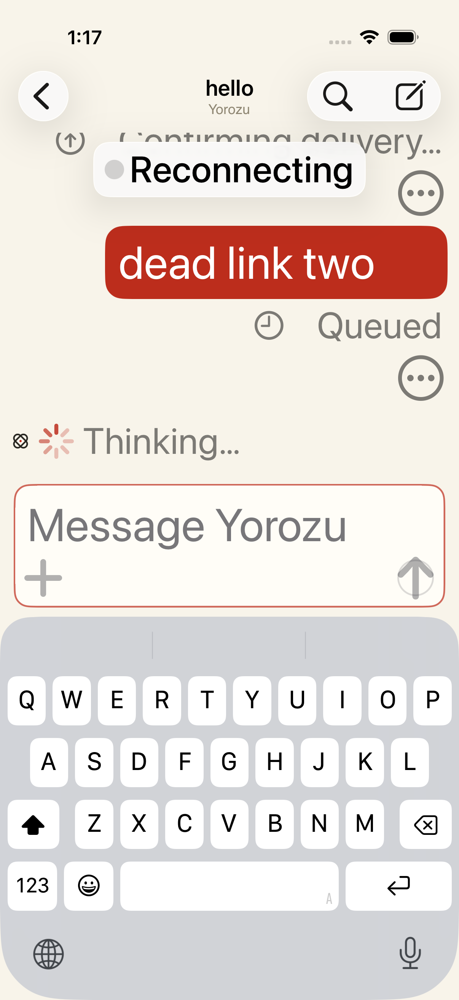

# iOS connection toast evidence

At `2acff06`, the focused `ConnectionTests.testAReconnectingLinkIsShownOnlyWhenItLastsAndClearsItself` run passed on an iPhone 17 Pro simulator running iOS 26.5 against the real relay and Mac sidecar through the fault proxy. A short disconnect showed no status or toast. A sustained blackhole showed one toast after the connection grace; the empty-list content's vertical position and height stayed within one point of their connected values. The toast dismissed while Settings kept a disconnected status, and healing restored **Connected** without moving list content. The screenshot below records that earlier empty-list run.

PR #143 changed the test to create and settle a thread before measuring the list. On the same simulator and relay fault proxy, its row kept the same vertical position and height through the toast; the focused test passed 1/1 and the full `ConnectionTests` class passed 4/4 with another test's thread already present. The short-drop, single-toast, dismissal, persistent Settings status, and recovery checks also passed. This verifies a stationary populated-list row as well as the earlier empty-list run.

## Large text and increased contrast

On 2026-09-28, current-main source `892d8fe2` passed both focused connection tests on an iPhone 17 Pro simulator running iOS 26.5 with `SIMULATOR_CONTENT_SIZE=accessibility-extra-large` and `SIMULATOR_INCREASE_CONTRAST=enabled`. PR #159 made those simulator settings reproducible and retained open-chat UI checks at this text size; its final test also passed with default settings.

The populated-list test again showed one readable toast after a sustained outage. The row stayed in place, the toast dismissed, Settings retained disconnected status, and connection recovered. At this text size, the brief toast overlays the noninteractive **Today** heading, while the thread row and navigation controls remain clear.

The open-chat test showed the same toast with the keyboard raised and two messages awaiting confirmation. After healing, both sent bubbles and the first and latest replies were visible while scrolling; the host recorded each send and answer once. The screenshot captures the pending state before recovery.

These simulator checks cover part of keyboard, safe-area, Dynamic Type, and contrast behavior.

## Reduced motion

On 2026-09-28, the same populated-list fault test passed on iPhone 17 Pro / iOS 26.5 with accessibility-extra-large text, increased contrast, and Reduce Motion enabled before app launch. A temporary test assertion confirmed `UIAccessibility.isReduceMotionEnabled` was true inside the simulator; the temporary setup and assertion were removed after the run. The test still observed short-drop silence, one sustained toast without moving or resizing the row, dismissal, persistent disconnected status, and recovery. This checks interaction semantics with the system setting active; it does not measure animation frames or replace installed-client visual review.

Gesture-time list reordering, diagnostics interactions, installed clients, and physical-device handoff still need acceptance checks.
